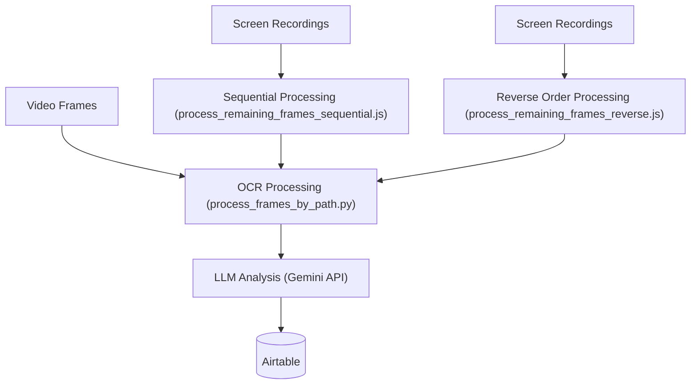

# OCR Pipeline

A comprehensive system for processing video frames with OCR and LLM analysis, designed to extract and analyze text from screenshots and images. This pipeline integrates seamlessly with Airtable for data management and utilizes Google's Gemini API for advanced text processing.

## What's New in v1.1.0

- **Improved Text Formatting**: Extracted text now has clear structure with categories and separators
- **Better Performance**: Eliminated redundant API validation calls between frames
- **Fixed GeminiProcessor**: Added missing method and improved error handling
- **Removed OCR-Only Mode**: All processing now includes LLM analysis for better results

## Architecture

The OCR Pipeline consists of several key components:



## Key Components

### Main Processors

- **process_frames_by_path.py**: Core Python script that handles OCR text extraction and LLM analysis for individual frames
- **process_frames_by_path_Reverse.py**: Variant that processes frames in reverse order
- **process_remaining_frames_sequential.js**: JavaScript processor for sequential frame processing
- **process_remaining_frames_reverse.js**: JavaScript processor for reverse-order frame processing
- **robust_ocr_worker.js**: JavaScript worker for robust OCR processing with retries and error handling
- **sequential_ocr_processor_Reverse.js**: Orchestrator for sequential OCR processing
- **gemini_processor.py**: Python module for interacting with the Gemini API

### Runner Scripts

- **run_ocr_pipeline.sh**: Main unified script that provides options for different processing modes
- **run_sequential_ocr_Reverse_Webhook.sh**: Shell script to run the OCR pipeline with webhook notifications
- **run_sequential_ocr_Reverse.sh**: Shell script for running sequential OCR

### Testing and Utility Scripts

- **test_ocr_formatting.py**: Demonstrates the new text formatting functionality
- **test_gemini_api.py**: Tests the Gemini API connection and available models
- **gemini_2_0_flash_example.py**: Example using Gemini 2.0 Flash models

## Features

- **Intelligent Text Extraction**: Uses Tesseract OCR for initial text extraction
- **LLM Enhancement**: Utilizes Google's Gemini API to clean OCR results and extract meaningful text
- **Structured Text Formatting**: 
  - Organized text with clear category labels (App:, UI:, Menu:, etc.)
  - Pipe separator symbols (|) between different UI elements and sections
  - Easily parseable format for downstream processing
- **Sensitive Information Detection**: Automatically flags frames containing sensitive information:
  - API keys (Google, AWS, Stripe, etc.)
  - Passwords and credentials
  - Payment card numbers (validated with Luhn algorithm)
  - Environment variables with sensitive values
- **Airtable Integration**: Stores processed results in Airtable for integration with other systems:
  - Structured OCR data in designated fields
  - Flagged status for frames with sensitive content
  - Detailed explanations of detected sensitive information
- **Webhook Notifications**: Notifies external systems (like n8n) when processing is complete
- **API Key Rotation**: Supports rotation of API keys to avoid rate limits
- **Error Handling**: Robust retry logic and error handling for maximum reliability
- **Performance Optimization**: Caches API validation results to prevent redundant calls

## Processing Options

### Sequential Processing
- Processes one frame at a time in chronological order
- Ideal for ensuring consistent, reliable processing
- Updates Airtable after each frame is processed

### Reverse Processing
- Processes frames in reverse chronological order (newest first)
- Useful for prioritizing recent frames

### Parallel Processing
- Processes multiple frames concurrently with worker processes
- Significantly faster for large batches of frames
- Includes API key rotation to avoid rate limits

## Usage

### Prerequisites

- Python 3.8+
- Node.js 14+
- Tesseract OCR installed (`apt-get install tesseract-ocr`)
- Google Gemini API key(s)
- Airtable Personal Access Token and Base ID

### Setup

1. Configure the `.env` file with your API keys and settings (copy from `.env.example`)
2. Install Python dependencies: `pip install -r requirements.txt`
3. Install Node.js dependencies: `npm install`

### Running the Pipeline

#### Unified Runner Script

The `run_ocr_pipeline.sh` script provides a unified interface for all processing options:

```bash
# Sequential processing (default)
./run_ocr_pipeline.sh --mode=sequential

# Process a specific folder in reverse order
./run_ocr_pipeline.sh --mode=reverse --folder=/path/to/folder

# Parallel processing with webhook notifications
./run_ocr_pipeline.sh --mode=parallel --webhook

# Skip Airtable updates (JSON output only)
./run_ocr_pipeline.sh --mode=sequential --skip-airtable
```

#### Specific Processor Scripts

For sequential processing with webhook notifications:
```bash
./run_sequential_ocr_Reverse_Webhook.sh
```

For processing a specific folder:
```bash
./run_sequential_ocr_Reverse_Webhook.sh --folder=/path/to/folder
```

For running the JavaScript processors directly:
```bash
# Sequential processing
node process_remaining_frames_sequential.js

# Reverse order processing
node process_remaining_frames_reverse.js
```

#### Testing Text Formatting

Try the new text formatting functionality:
```bash
python test_ocr_formatting.py --image "/path/to/image.jpg"
```

## Airtable Integration

The system integrates with Airtable to store OCR results and metadata:

### Field Structure
- **OCRData**: Cleaned and structured text extracted from frame images
- **Flagged**: Boolean flag indicating if sensitive content was detected
- **SensitivityConcerns**: Detailed explanation of the sensitive information detected

### Update Process
- Records are updated only after successful OCR and LLM processing
- Batch updates respect Airtable's 10-record batch update limit
- Rate limiting prevents hitting Airtable API limits

## Environment Variables

Key environment variables needed in the `.env` file:

- `AIRTABLE_PERSONAL_ACCESS_TOKEN`: Your Airtable PAT
- `AIRTABLE_BASE_ID`: Your Airtable base ID
- `AIRTABLE_TABLE_NAME`: Table name for frame data (default: tblFrameAnalysis)
- `AIRTABLE_TRACKING_TABLE`: Table for tracking processed folders (default: Finished OCR Processed Folders)
- `AIRTABLE_RATE_LIMIT_SLEEP`: Sleep time between Airtable API calls (default: 0.25s)
- `GOOGLE_API_KEY`: Gemini API key
- `GEMINI_API_KEY_1` through `GEMINI_API_KEY_5`: Additional Gemini API keys for rotation
- `GEMINI_PREFERRED_MODEL`: Preferred Gemini model (default: models/gemini-2.0-flash-exp)
- `BASE_DIR`: Base directory for screen recordings
- `MAX_WORKERS`: Maximum number of concurrent workers for parallel processing 